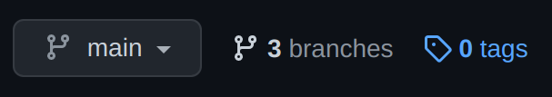
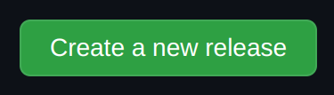
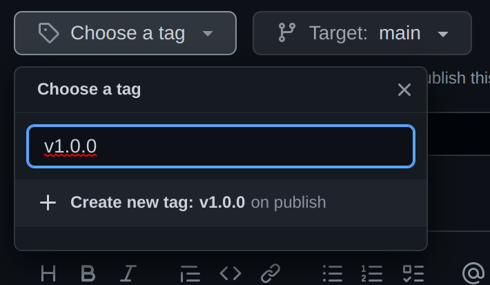
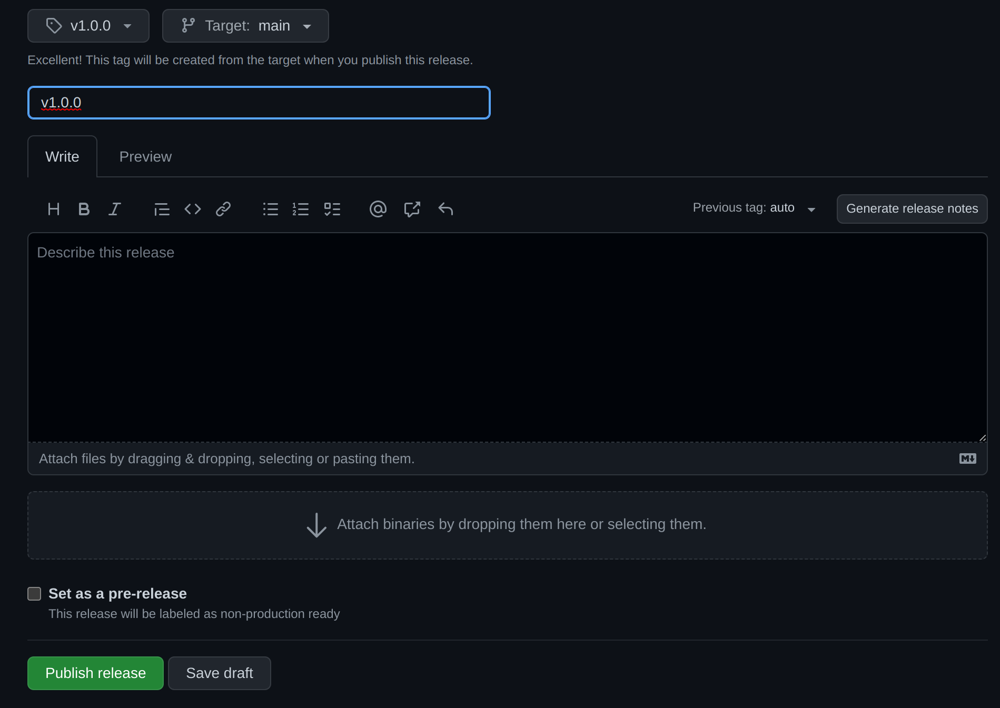

### ✌ Welcome!

These is a package created for centralizing the advise system UI components 😄

### 🛠 Installation

You can install these package using when testing the changes made on the new system ```bash npm install git+ssh://git@github.com:Andrinoid/adviseTable.git --legacy-peer-deps --force```

If you have finished your changes, it's important to create a new release of it's associated tag, you can do it here:






Then you should be able to install the package using ```bash npm install git+ssh://git@github.com:Andrinoid/adviseTable.git#v1.0.0 --legacy-peer-deps --force```

### 💻 Configuration

You can run the code using ```bash npm run start```, don't forget of installing the dependencies before using ```bash npm install```, there you will have a place to visually test the package code that you are developing.

It's important to notice that only the code exported on the build entrypoint defined on 
```bash rollup.config.js``` ```bash input: 'src/Table/index.js'``` will be builded and exported by the package.